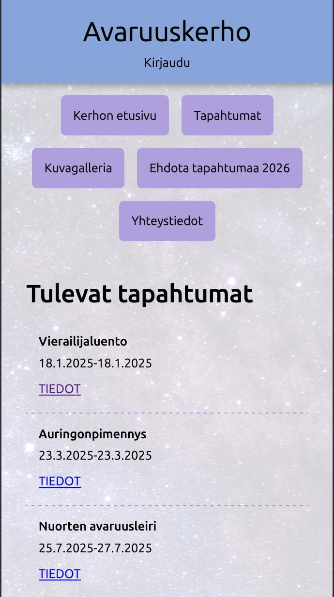

# Avaruuskerho – fiktiivisen kerhon kotisivut

**Avaruuskerho** on fiktiivisen tähtitiede kerhon kotisivuprojekti. Sivustolla voi selata kerhon tapahtumia, ilmoittautua niihin sekä ehdottaa uusia tapahtumia. Vuoden 2026 uusien tapahtumien ehdottaminen on mahdollista ilman kirjautumista.  Sivustolla on lisäksi kuvagalleria sekä yhteystieto-sivu. Sen tyylejä on optimoitu myös mobiililaitteille. Admin-sivut ovat vielä keskeneräiset.

Projekti on toteutettu Backend-opintojen näyttötyönä SASKY:n Fullstack-koodaajan opinto-ohjelmassa. Projektia on toteutettu [Lanify-opintotehtävän](https://neutroni.hayo.fi/~p51731/lanify/) pohjalta.

---

## Tekniikat

- Apache  
- MariaDB  
- SQL  
- PHP  
- Plates (PHP templating)  
- HTML5  
- CSS3  

---

## Projektin tila

Tämä opintoprojekti on keskeneräinen ja sitä kehitetään edelleen.

---

## Ylläpitäjä

Tätä projektia ylläpitää

**Marjo Lumijärvi**  
GitHub: [https://github.com/MarjoL555](https://github.com/MarjoL555)

---

## Lisenssi

Tämä projekti on julkaistu MIT-lisenssillä.  
Lisätiedot löytyvät [LICENSE](LICENSE)-tiedostosta.
